# crud-firestore-pessoa

Este é um projeto construído com o framework Quarkus e será exemplificado um CRUD de pessoa utilizando o banco de dados Firestore.

## Quarkus

[Link para criar o projeto em quarkus.](https://code.quarkus.io/ "Quarkus") 

## Biblioteca

[Link da documentação da biblioteca utilizada.](https://docs.quarkiverse.io/quarkus-google-cloud-services/main/firestore.html "Quarkiverse") 

## Configuração

application.properties

    firestore.projectId=crud-firestore-pessoa
    firestore.collectionRoot=CollectionRoot
    firestore.collectionLeaf=dados
    firestore.credentialsFile=sua-chave.json
    
 - firestore.projectId - Nome do projeto utilizado no console do Firestore.
 - firestore.collectionRoot - Nome da collection principal dentro do banco de dados. Este nó poderia ser definido por cliente.
 - firestore.collectionLeaf - Nome da collection que representa o respositório dos registros dentro da "tabela".
 - firestore.credentialsFile - Arquivo de credencial obtida no console do Firestore. **OBs: O arquivo deverá ser armazenado em src/main/resources**
 
 
## Anotações

- @Collection - Define que a classe anotada será uma collection dentro do Firestore. Nesta anotação será necessário informa qual o nome da collection.
- @OrderBy - Define qual atributo será utilizado na ordernação.

## Classes

### FirestoreCollectionImpl

Classe responsável pela conexão ao Firestore e manipulação das collections.

### FirestoreRepositoyImpl

Classe ancestral padrão para implementação do repository. Esta classe possui a implementação de todos os métodos padrões para
manipulação da collection.

## Criando uma base no Firestore.

### 1º Acesse o console do Firestore
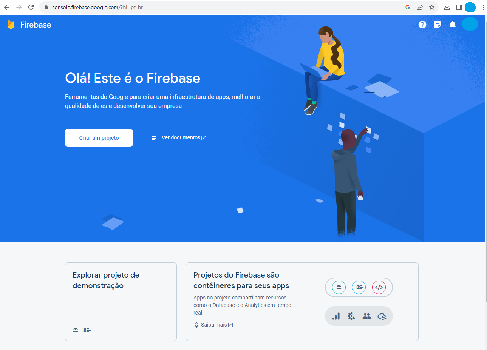

Clique no botão "criar um projeto".

### 2º Informe um nome para o projeto.
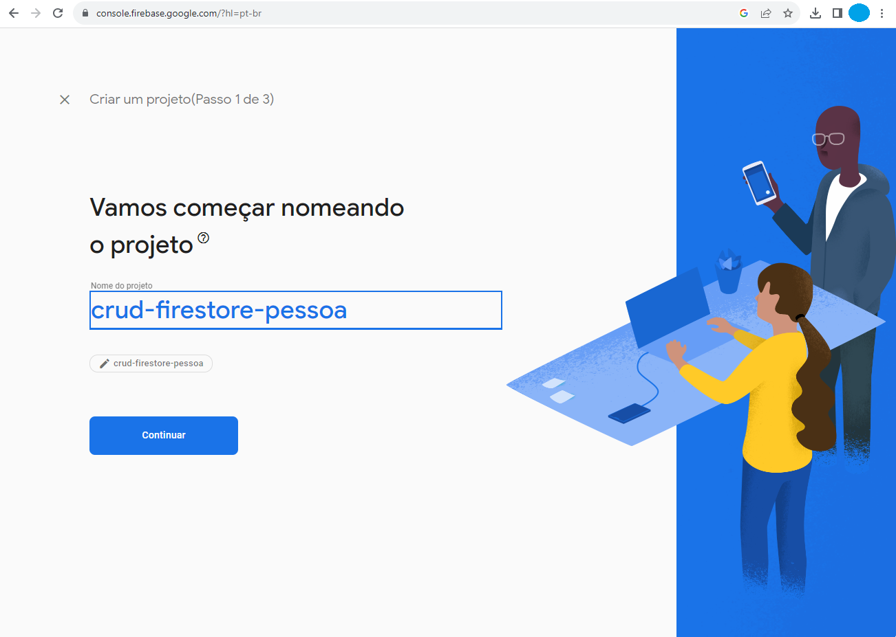

### 3º Configure o Google Analytics.

### 4º Informe a localização para o Google Analytics.

### 5º Aguarde.
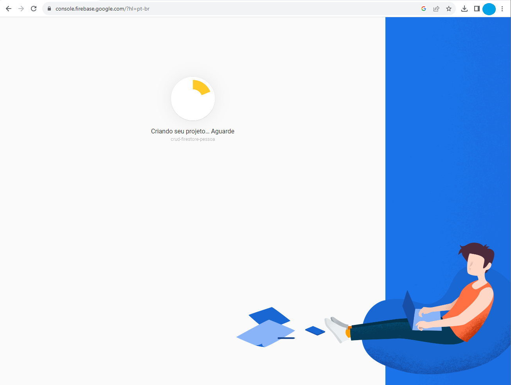

### 6º Clique no menu "Firestore Database".

### 7º Clique em "Criar banco de dados".
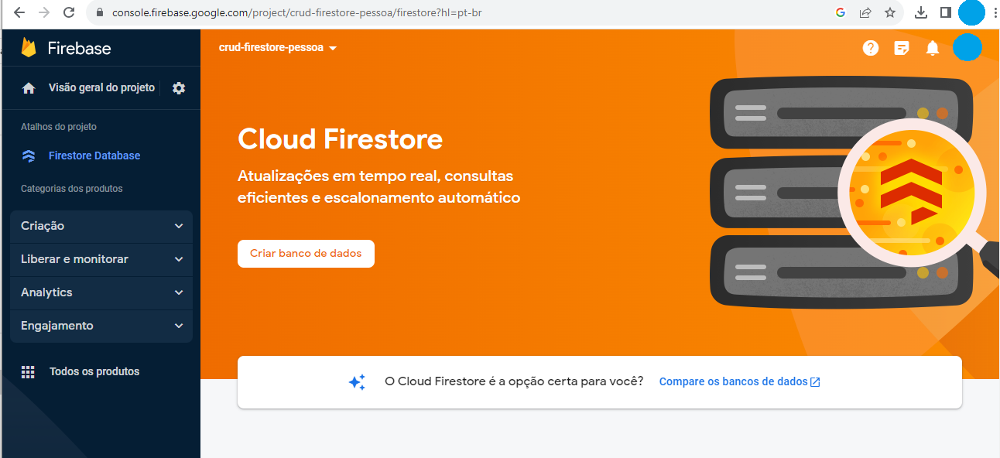

### 8º Inicie em modo produção. Clique em "Avançar"
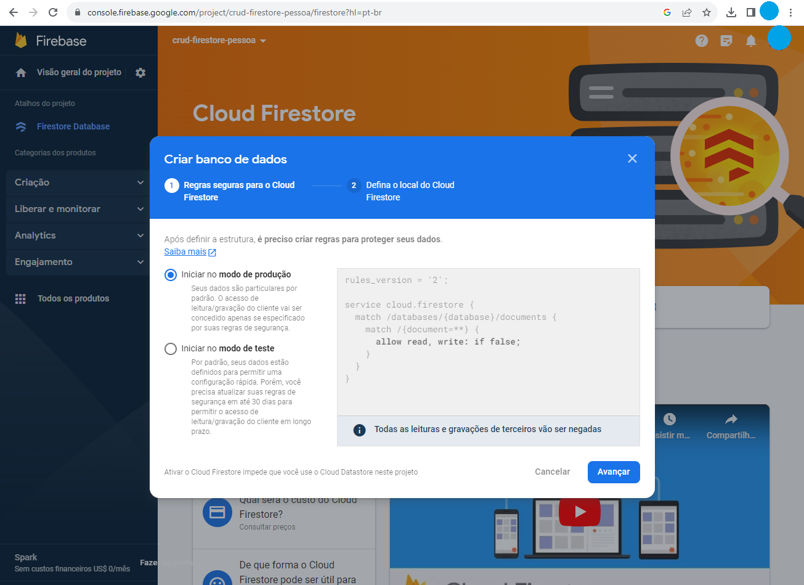

### 9º Defina o local do Cloud Firestore
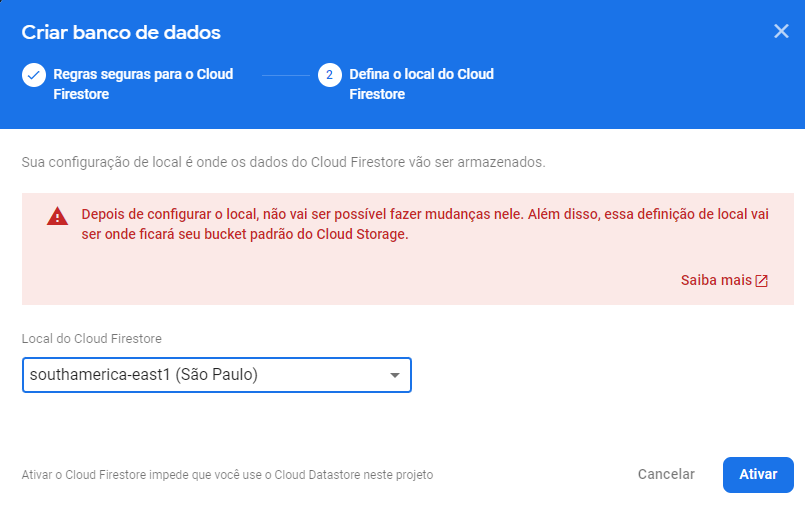

### 10º Aguarde
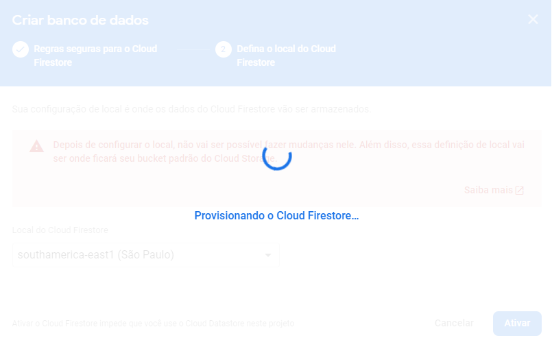

### 11º Pronto! Base criada.
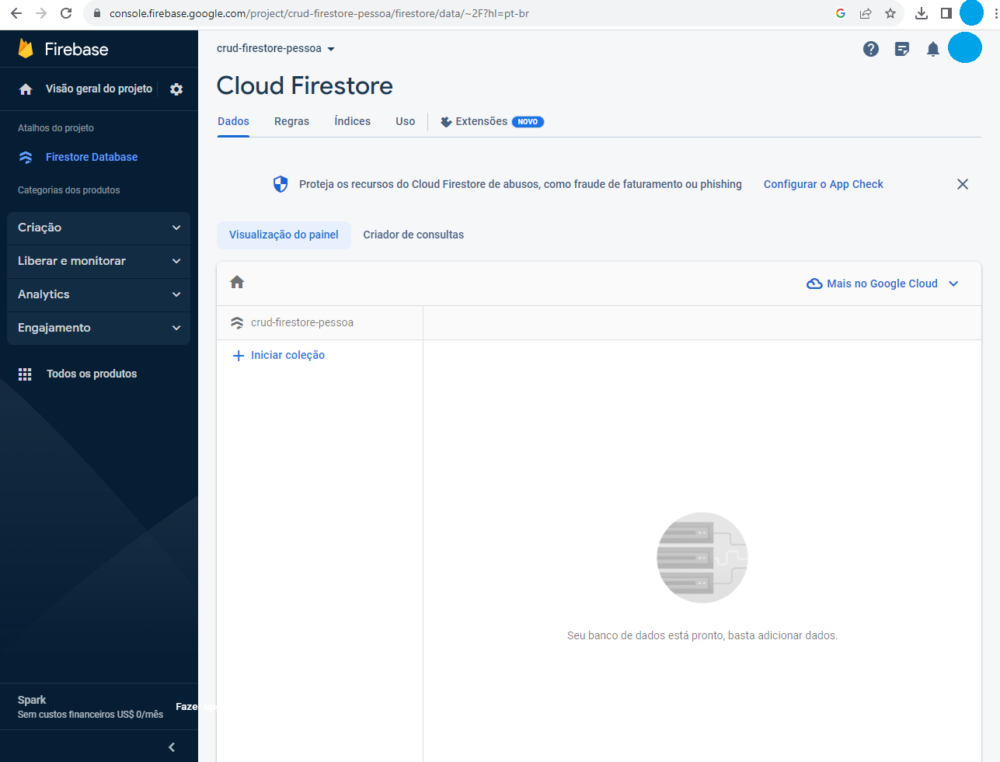

### 12º Agora vamos gerar arquivo de credencial. Clique em "Configurações do projeto"
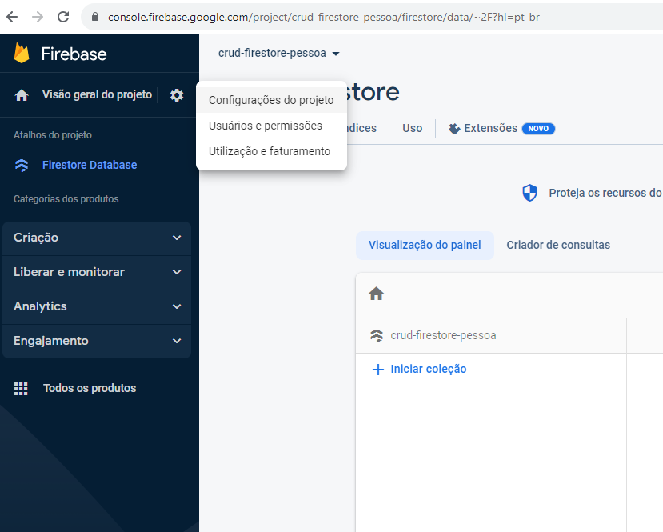)
### 13º Selecione java e clique em "Gerar nova chave privada"
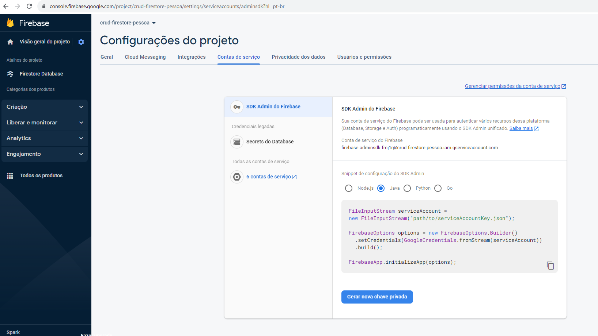

### 14º Clique em "Gerar chave"
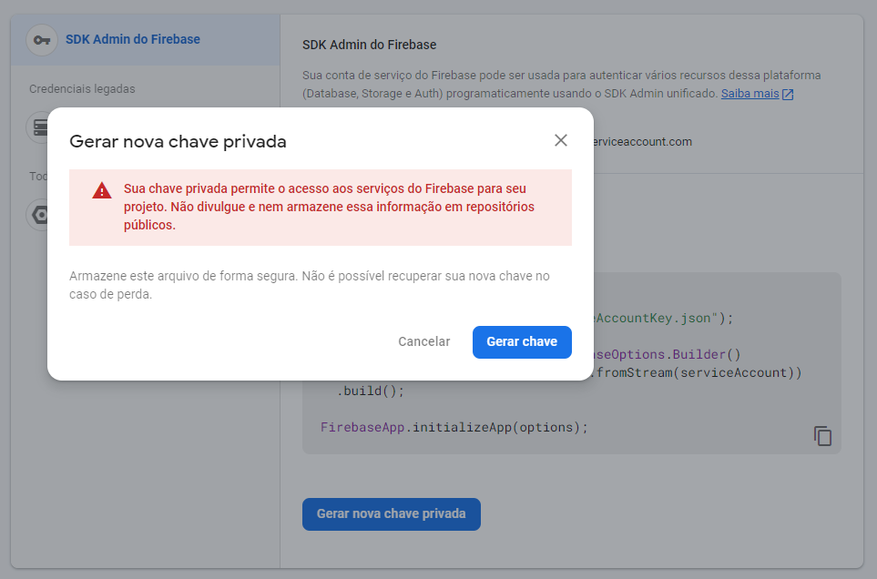

### 15º Cole a chave gerada dentro de src/main/resources. Lembre de editar o nome do arquivo dentro de applicatoin.properties
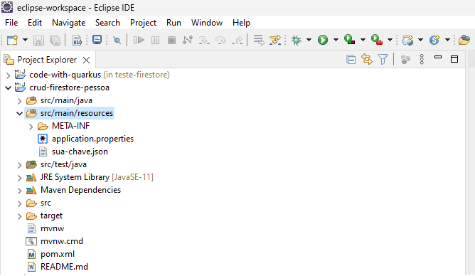

